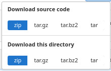

#  DeepFaune GUI

---

# 1. INSTALLING DEEPFAUNEGUI

---

** STEP 1 **
First of all, get the `zip` archive by clicking on the button  on the top right of this page.

This will open this window where you can dowload the whole directory as a `zip` file (warning, it's a huge file)  

Uncompress the zip file on your Desktop.

** STEP 2 **

**Linux:**

- Python 3.x (and `pip` which might be called `pip3` on your system)
- Tensorflow: `pip install tensorflow`
- Pandas: `pip install pandas`
- Numpy: `pip install numpy`
- PIL: `pip install pillow`
- openpyxl (optionnel): `pip install openpyxl`

Alternatively, you can use `conda`.

**Windows**

- Anaconda Individual Edition: available [here](https://www.anaconda.com/products/individual) (install can take time)

WARNING: during installation, you will be asked to choose a path to install Ananconda files. It will be `C:\Users\yourname\anaconda3` by default. PLEASE REMEMBER THIS PATH FOR FURTHER USE.

- Open Anaconda window, search for `tensorflow` and click to install it.

- Edit file `deepfauneGUI.bat` and replace `\Users\Laurie\anaconda3` by the path that you chose just before

---

# 2. RUNNING DEEPFAUNEGUI

---

**Linux:**

In a terminal, launch `python deepfauneGUI.py`

**Windows**

Click on `deepfauneGUI.bat` or `deepfauneGUI.vbs`

HAVE FUN NOW !!

---

# 3. CONTACT

---

For any question, bug or feedback, feel free to send an email to [Vincent Miele](https://lbbe.univ-lyon1.fr/-Miele-Vincent-.html) <!--or use the Gitlab Service Desk-->

---

# 4. TROUBLESHOOTING

---

**T1:** How can I learn more about machine learning ?

You can watch these [series of 3 french videos](https://imaginecology.sciencesconf.org) (video 1 is the easiest).

