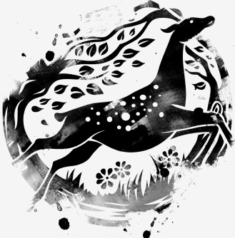
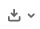

#  WELCOME TO DEEPFAUNE SOFTWARE REPOSITORY

---
# NEWS
---

Release v0.3 is available. 

Supported categories/species :  BADGER, IBEX, RED DEER, CHAMOIS/ISARD, CAT, ROE DEER, DOG, SQUIRREL, LAGOMORPH, WOLF, LYNX, MARMOT, MICROMAMMAL, MOUFLON, SHEEP, MUSTELIDE, BIRD, FOX, WILD BOAR, COW, HUMAN/VEHICLE, EMPTY

---
# INSTALL
---

## FOR WINDOWS USERS

The latest versions are available at:
[https://pbil.univ-lyon1.fr/software/download/deepfaune/](https://pbil.univ-lyon1.fr/software/download/deepfaune/)

1. Download the latest `zip` file
2. Uncompress the file on your Desktop
3. Double-click on `deepfauneGUI.exe`

## FOR LINUX / MAC OS USERS (and WINDOWS  USERS used to Python)

### 1. Get the source code of the latest release, directly from this site. 
First of all, get the `zip` archive by clicking on the button  on the top right of [https://plmlab.math.cnrs.fr/deepfaune/software/-/tags](https://plmlab.math.cnrs.fr/deepfaune/software/-/tags). 
This will open the following window where you can download the whole directory as a `zip` file (warning, it's a huge file):

Then, uncompress the zip file.

###  2. Download and unzip the model parameters
Download the model parameters *inside the deepfaune folder* where you can find `deepfauneGUI.py`:
- Animal detector parameters: for version >=0.3 [deepfaune-yolov4.weights](https://pbil.univ-lyon1.fr/software/download/deepfaune/)
 (for version <=0.2 [checkpoints.zip](https://pbil.univ-lyon1.fr/software/download/deepfaune/))
- Classifier parameters: [efficientnet_xxxx.hdf5](https://pbil.univ-lyon1.fr/software/download/deepfaune/)

### 3. Install the dependencies

On Linux or Windows **with PyPi (pip)**:

- Python 3.x (and `pip` which might be called `pip3` on your system)
- Tensorflow: `pip install tensorflow`
- Pandas: `pip install pandas`
- Numpy: `pip install numpy`
- OpenCV: `pip install opencv-python`
- PIL: `pip install pillow`
- (optional, for Excel users only) openpyxl: `pip install openpyxl`
- (for some users, it may be necessary to install `python3-tk` as well, when you have a message `no module tkinter`)

On Windows with **[Anaconda Individual Edition](https://www.anaconda.com/products/individual)** (WARNING: during installation of Anaconda, you will be asked to choose a path to install Ananconda files. It will be `C:\Users\yourname\anaconda3` by default. PLEASE REMEMBER THIS PATH FOR FURTHER USE).

- Open Anaconda window, search for `tensorflow` and click to install it, , as explained [here](https://docs.anaconda.com/anaconda/navigator/tutorials/manage-packages/)
- (optional) Open Anaconda window, search for `openpyxl` and click to install it

---
# USING DEEPFAUNE
---

### Running the Python script

In a terminal, launch `python deepfauneGUI.py` or `python.exe deepfauneGUI.py`

You can use the GUI, and you can also consult [the user manual](https://plmlab.math.cnrs.fr/deepfaune/software/-/tree/master/man).

### Using the API

You can implement your own scripts using the DeepFaune API. A *minimal example* is [available here](https://plmlab.math.cnrs.fr/deepfaune/software/-/tree/master/demo/testPredictor.py). Another *minimal example* using a JSON file generated by MegaDetector is [available here](https://plmlab.math.cnrs.fr/deepfaune/software/-/tree/master/demo/testPredictorJSON.py)

---
# CONTACT
---

For any question, bug or feedback, feel free to send an email to [Vincent Miele](https://lbbe.univ-lyon1.fr/-Miele-Vincent-.html) <!--or use the Gitlab Service Desk-->

---
# LICENCE
---

`deepfaune` is released under the [CeCILL](http://www.cecill.info) licence, compatible with [GNU GPL](http://www.gnu.org/licenses/gpl-3.0.html)

Commercial use of any element of `deepfaune` is forbidden.

---
# REFERENCES
---

[Rig22] Rigoudy, N., the DeepFaune consortium, Spataro, B., Miele, V. & Chamaillé-Jammes, S. (2022) *The DeepFaune initiative: a collaborative effort towards the automatic identification of the French fauna in camera-trap images.* [Preprint bioRxiv](https://biorxiv.org/)

[Mie21] Miele, V., Dray, S., & Gimenez, O. (2021). *Images, écologie et deep learning.* [Regards sur la biodiversité](https://sfecologie.org/regard/r95-fev-2021-miele-dray-gimenez-deep-learning/)

---

# FREQUENTLY ASKED QUESTIONS

---

> How can I learn more about machine learning?

You can watch these [series of 3 french videos](https://imaginecology.sciencesconf.org) (video 1 is the easiest).

> Is the `deepfaune` software free?

Yes, it is a free software. Commercial use is forbidden, according to the [CeCILL LICENCE](https://plmlab.math.cnrs.fr/deepfaune/software/-/blob/master/LICENCE.txt). But, if you appreciate our work, please cite our work and/or contribute by sharing with us your annotated images.

> Can I have access to the images used in the DeepFaune project?

No. We do not share the images of our partners.

> Can I contribute to the DeepFaune project with my images?

It would be great!! You can contact us to see how you can send us your images (we have different solutions). We will store them in a secure server with private access to the members of the deepfaune project.
 
> Who is developing this DeepFaune project ?

A team in CNRS-INEE leaded by Simon Chamaillé-Jammes (CEFE) and Vincent Miele (LBBE). Please have a look at our website [https://www.deepfaune.cnrs.fr/](https://www.deepfaune.cnrs.fr/).

 
 

---
---
Logo artwork: Rochak Shukla - www.freepik.com

